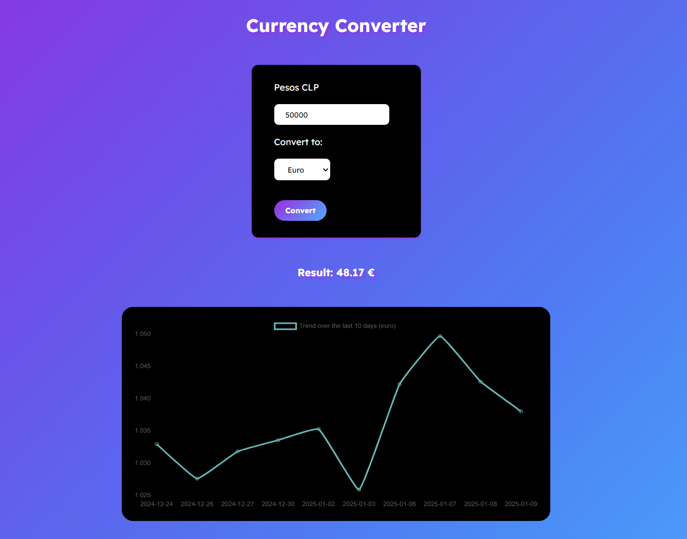

# Currency Converter CLP

This tool allows users to convert Chilean Pesos (CLP) to either Euro or Dollar. After conversion, it displays a chart showing the historical trend of the selected currency over the last 10 days.

## Features
- Convert Chilean Pesos to Euro or Dollar.
- Fetch real-time exchange rates using the [mindicador.cl](https://mindicador.cl/) API.
- Display a 10-day historical trend of the selected currency in a responsive chart.

## Preview

